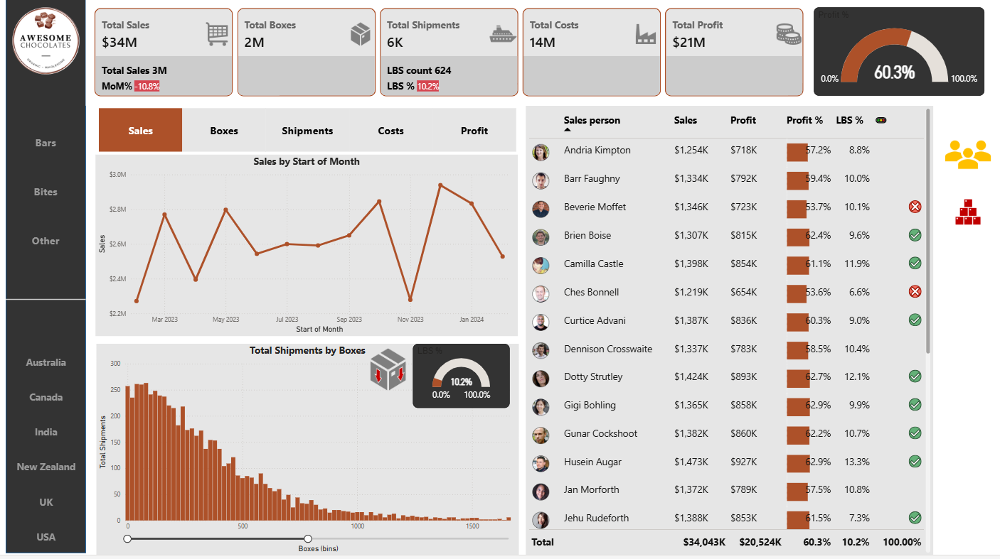

# Chocolate Sales Analytics Dashboard

## Project Overview

This project presents an **interactive Power BI dashboard** built using a comprehensive chocolate products sales dataset.

The dashboard delivers detailed visual analysis of:
- Product performance
- Regional sales distribution
- Profitability metrics
- Overall operational performance

---
## 👥 Team Project

This dashboard was developed as part of a collaborative team project with:
- Nusaiba kambal
- Arwa Hassan
- Nesreen Adam
- Afag Mohammed

We worked together across different stages 

---
## Dashboard Preview

---

### KPI Cards
Quick performance snapshot including:
- Total Sales: **$34M**
- Total Boxes Sold: **2M**
- Shipments: **6K**
- Total Profit: **$14M**

### Product Analysis
- Bar charts highlighting top-selling chocolate products by revenue.
- Product-level performance comparison.

### Regional Distribution
Sales breakdown across:
- Australia  
- Canada  
- India  
- New Zealand  
- UK  
- USA  

### Profitability Analysis
- Product-wise profit percentage analysis.
- Identification of most profitable chocolate products.

### Time Series Analysis
- Monthly sales trends from **March 2023 to January 2024**.
- Clear visibility of seasonal performance patterns.

### Dynamic Slicer
- Interactive filtering by product or region.
- Enables flexible and customized data exploration.

---

## Skills & Tools Used

- **Power BI** – Dashboard development & visualization  
- **Data Modeling & DAX** – KPI calculations & performance metrics  
- **Data Cleaning & Transformation** – Ensuring data accuracy  
- **Dashboard Design Principles** – Creating intuitive user experience  

---

## Project Purpose

- Analyze chocolate product demand and sales trends  
- Identify top-performing products by revenue and profitability  
- Track regional sales performance across international markets  
- Support data-driven decision-making  
- Transform raw sales data into actionable insights
---
## 🔗 Live Dashboard
You can explore the interactive dashboard here: [View Power BI Report](https://app.powerbi.com/view?r=eyJrIjoiNDkzOTRlZDctZmY1Ny00Mzc2LThlNzEtM2E1ZGZhMjg5NTQxIiwidCI6ImMwMjMwYzg0LWRiNzctNGVhYS04OTYyLTJlNzY2MmFhOWQ3NyIsImMiOjl9)

## This project is co

